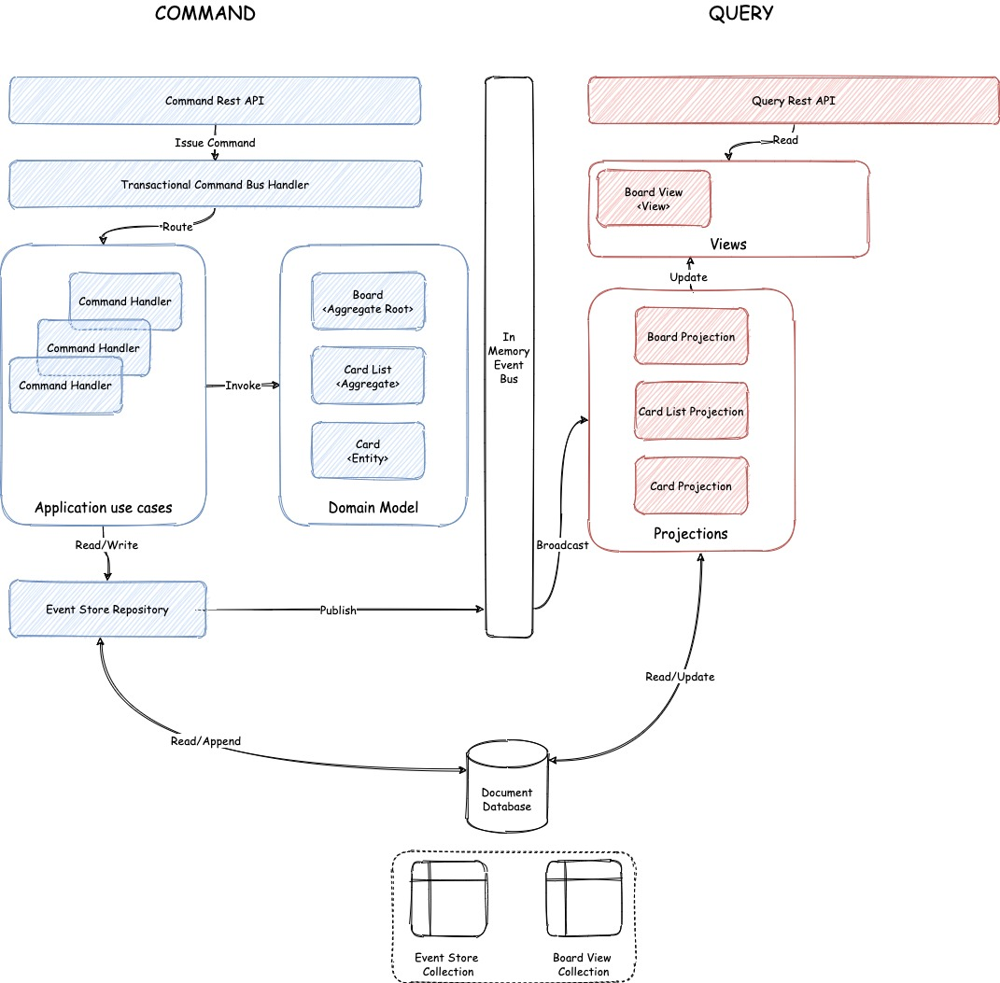
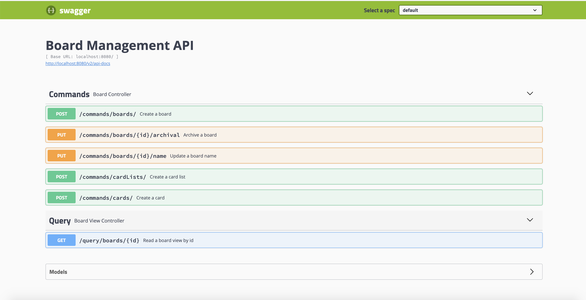

# Board Management Tool "Trello-Like"


[](https://sonarcloud.io/dashboard?id=selimyanat_board-management-tool)

# Introduction

This is a simple application that mimic a board management tool such as 
[Trello](https://trello.com/en) but with a very limited scope. The motivation behind this is to drill down into a CQRS 
"Command Query Responsibility Segregation" architecture by covering a wide range of concepts such
 as `Aggregate`, `Command handler`, `Even Store`, `Projection` and `View`) with a simple domain but 
 complex enough to highlights the challenges involved with this architecture. 


# Architecture




CQRS states that an application architecture is divided in two parts:

- Command side: Also referred as the write side, where commands are validated and turned into
 events that are persisted and published. An important attribute of a command is that it conveys the 
 intent of the user. In contrast with the CRUD-based approach, where four basic
 operations are available for users CRUD (`Create`,`Edit`, `Save` and `Delete`). As a consequence
 CQRS, goes hand in hand with the [Task-Based](https://walkerjordan.com/task-based-user-interfaces/) 
 User Interface pattern.  

- Query side: Also referred as the read side, where events are combined to create view models that 
are optimized to serve client requests. Unlike commands, queries do not need to involve the Domain 
Model because queries do not execute any operations and should not contain any business logic. In
addition, queries have no side effects and are completely idempotent, unless the system state
 changed in the meantime.

Note, in this application we implement CQRS architecture in combination with Event Sourcing
, but CQRS without Event Sourcing is still a viable architectural approach offering quite some
benefits.

# Features

The application exposes the following features through a REST API that can be accessed through
swagger at `http://localhost:8080/swagger-ui.html#/`.

- Create a board.

- Update a board name.

- Archive a board.

- Create a list of card.

- Create a card.

- Read a board.




# Technical Environment

The is a self contained application based on **Spring Boot** that runs an embedded
servlet container running by default on port 8080 that expose a **REST API**. The following list
the main frameworks and libraries used to implement this application:

- [spring boot](https://spring.io/projects/spring-boot): Simple and rapid framework to create
 simple and web based applications.
- [lombok](https://projectlombok.org/) : Framework auto generating code for java (getter, setter, ...).
- [vavr](http://www.vavr.io): Functional library for java.
- [mongodb](https://www.h2database.com/html/main.html) : Lightweight in-memory nosql database.
- [swagger](https://swagger.io/): Specification for machine-readable interface files for
describing, producing, consuming, and visualizing RESTful web services 
- [Junit 5](https://junit.org/junit5/): The next generation of testing framework for java.
- [AssertionsJ](http://joel-costigliola.github.io/assertj/): Fluent assertions for java.

# Build

## Requirements

* Java 11 or higher
* Maven 3.5 or higher

## Build

```  
mvn clean package 
```

## Run the application

###  IDE

Run the main class `BoardManagementApplication`.

###  Maven

Open your terminal, navigate to the `TicketingSystemApplication` source directory then run the
 following command: 

```
mvn spring-boot:run
```

### Java

Open your terminal, navigate to the `TicketingSystemApplication` source directory then run the
 following command:  

```
java -jar target/ticketing-system-0.0.1-SNAPSHOT.jar
```
 

